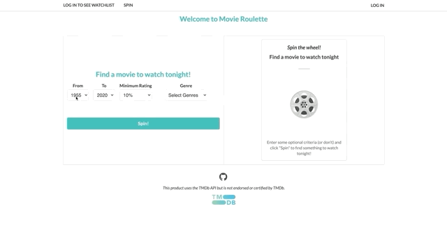

# Movie Roulette 

---

Movie Roulette is a great tool to use when you can't figure out which movie to watch. Using a simple interface, you can enter parameters for a movie you'd like to see and "Spin" the movie roulette wheel. I have definitely found some hidden gems (along with hidden not-so-gems) while creating this app.

Movie Roulette supports authentication using the TMDb API.

Movie roulette was built with [React](https://reactjs.org/) and is powered by [The Movie Database](https://www.themoviedb.org/) API.

[Try it out for yourself!](https://movieroulette-eaf13.web.app/)

## You can select a movie

---

  

## And add to your watchlist with TMDb integration.

---

  

## What's under the hood

---

- **React**: v16.13.1
- **React Redux:** v7.2.0
- **Redux Thunk:** v2.3.0
- **React Router:** v5.2.0
- **Redux Persist:** v6.0.0
- **Axios:** v0.19.2

- **TMDB API:** v3

- **Hosted on Firebase**

## Installation instructions

---
Make sure you have `npm` installed on your m

Once repository is downloaded, `cd` to top level directory and run:

`npm install`

Once installed, run:

`yarn start` or `npm start`

Happy spinning!